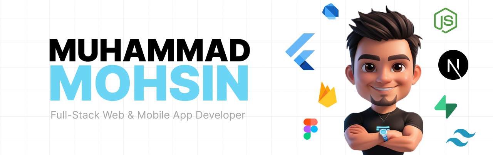

<h1 align="center">
    

  

 
  
  
  

<h3 align="center">Languages and Tools I mosttly use:</h3>

                                

<h2 align="center">My Stats </h2>
 

  
  
   
  

  

- 🌱 I’m currently learning **Next Js**

- 👨‍💻 All of my projects are available at [https://m6474n.github.io/](https://m6474n.github.io/)

- 💬 Ask me about **Flutter, Dart, Firebase**

- 📫 How to reach me **m.mohsin2055@gmail.com**

<h3 align="left">Connect with me:</h3>

